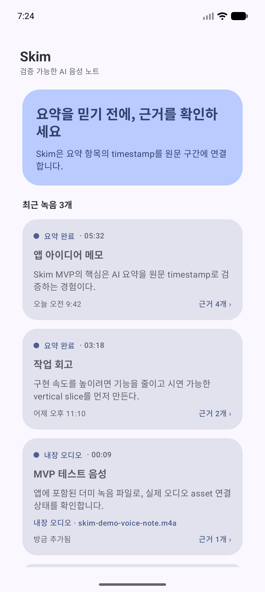
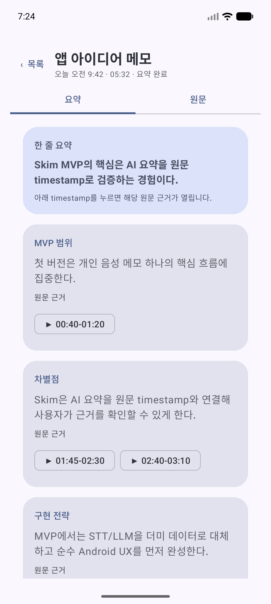
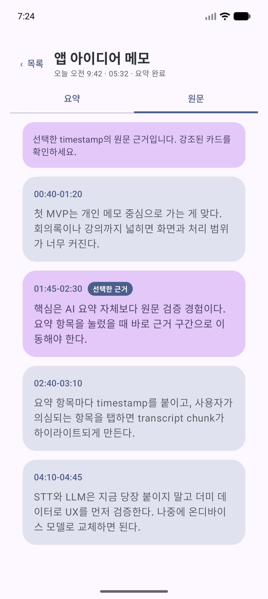

# Skim — 검증 가능한 AI 음성 노트 UX

> **AI 요약을 결과 화면에 고정하지 않고, 각 요약 항목을 원문 transcript의 timestamp와 연결한 Android MVP입니다.**

[](#기술-구성) [](#구현-범위) [](#mvp-범위와-제약) [](#mvp-범위와-제약)

## 문제와 접근

AI가 만든 요약은 빠르지만, **사용자가 근거를 바로 확인할 수 없으면 신뢰하기 어렵습니다.** Skim은 이 문제를 다음의 작은 상호작용으로 검증합니다.

```text
녹음 목록 → 요약 상세 → timestamp 탭 → 원문 탭 전환 → 해당 transcript chunk 강조
```

사용자는 요약 카드의 `▶ 01:45–02:30` chip을 누르면, 같은 timestamp의 원문 구간으로 이동해 요약의 근거를 확인할 수 있습니다.

## M2 — network / local architecture

- `MainActivity`가 수동 DI로 `Retrofit → DefaultSkimRepository → Room`을 조립하고 `SkimMainViewModel`을 생성합니다.
- `SkimMainRoute`는 ViewModel의 `Loading`, cached `Content`, refresh error 상태를 lifecycle-aware flow로 렌더링합니다. 화면은 더 이상 `FakeSkimRepository`를 직접 읽지 않습니다.
- refresh는 `/v1/recordings`와 각 recording의 transcript/summary를 받아 Room cache를 교체합니다. 기본 emulator endpoint는 `http://10.0.2.2:8080/`이며, port conflict 환경에서는 `./gradlew -PskimBaseUrl=http://10.0.2.2:8081/ :app:assembleDebug`로 override할 수 있습니다.
- 이 milestone은 seed 결과 표시와 offline cache 경계를 구현합니다. Android의 Todo UI, upload/processing polling, Media3 seek/play은 후속 milestone 범위입니다.

## 데모 플로우

1. 녹음 목록에서 `앱 아이디어 메모` 또는 `작업 회고`를 엽니다.
2. `요약` 탭의 summary card 아래 timestamp chip을 누릅니다.
3. 앱이 `원문` 탭으로 전환되고 해당 transcript chunk까지 자동 스크롤합니다.
4. 선택된 chunk는 `선택한 근거` badge와 색상으로 구분됩니다.
5. 상단 `‹ 목록`으로 목록으로 돌아갑니다.

| 목록 | 요약 상세 | 원문 근거 강조 |
| --- | --- | --- |
|  |  |  |

## 구현 범위

| 구현됨 | 의도적으로 제외한 범위 |
| --- | --- |
| 3개의 로컬 seed recording 목록과 상세 진입 | 실제 마이크 녹음 및 권한 처리 |
| 카테고리별 summary card와 one-line summary | audio playback / Media3 seek |
| `SummarySource(chunkId, label)`로 요약과 원문 근거 연결 | STT / Whisper 전사 |
| timestamp 탭 시 원문 탭 전환 및 자동 scroll | LLM 요약/API 호출/온디바이스 모델 |
| 선택된 transcript chunk badge·색상 강조 | Room, WorkManager, 로그인, 동기화 |
| APK에 포함된 `.m4a` demo asset 표기 | 검색·공유·export·백엔드 |

**왜 seed data인가?** 모델 품질·API key·네트워크에 MVP를 묶지 않고, 먼저 “요약에서 원문 근거로 돌아가는 UX”가 이해 가능하고 신뢰를 주는지 검증하기 위해서입니다. 실제 STT/LLM은 이후 동일한 UI 모델 계약을 유지하며 대체할 수 있습니다.

## 데이터 모델과 구조

```text
Recording
 ├─ summaryItems: SummaryItem[]
 │   └─ sources: SummarySource[]  ──► TranscriptChunk.id
 └─ transcriptChunks: TranscriptChunk[]
```

| 경로 | 책임 |
| --- | --- |
| `app/src/main/java/com/example/skim/model/SkimModels.kt` | `Recording`, `SummaryItem`, `SummarySource`, `TranscriptChunk` 모델 |
| `app/src/main/java/com/example/skim/data/FakeSkimRepository.kt` | 결정적인 demo/seed data와 timestamp mapping |
| `app/src/main/java/com/example/skim/ui/main/MainScreen.kt` | Compose 목록·상세·탭 전환·자동 scroll·highlight UI |
| `app/src/androidTest/java/com/example/skim/ui/main/MainScreenTest.kt` | seed recording과 APK audio asset 노출 smoke test |

## 기술 구성

- Kotlin, Jetpack Compose, Material 3
- Android minSdk 23 / targetSdk 36 / Java 17
- Compose UI instrumentation test, JUnit unit test
- Local-only seed data — API key, 서버, 계정 없이 실행 가능

## 실행과 검증

```bash
./gradlew :app:testDebugUnitTest :app:assembleDebug
```

생성 APK:

```text
app/build/outputs/apk/debug/app-debug.apk
```

연결된 emulator/device가 있다면 다음으로 UI를 확인할 수 있습니다.

```bash
adb install -r app/build/outputs/apk/debug/app-debug.apk
adb shell monkey -p com.example.skim 1
```

2026-07-11에 `emulator-5554`에서 아래 runtime path를 실제 검증했습니다.

```text
→ 원문 탭 전환 → 선택한 근거 badge/강조 확인 → ‹ 목록으로 복귀
```

현재 UX 프로토타입의 포트폴리오 설명과 검증 증거는 [`docs/portfolio-case-study.md`](docs/portfolio-case-study.md)를 참고하세요.

풀스택 MVP 구현의 제품 목표, 데이터 계약, API 초안, 단계별 완료 기준은 [`docs/skim-fullstack-mvp-foundation.md`](docs/skim-fullstack-mvp-foundation.md)를 source of truth로 사용합니다.

## 포트폴리오에서의 위치

Skim은 **AI 기능을 과장하는 사례가 아니라, AI 결과를 사용자가 검증할 수 있도록 만든 제품/UX 사례**입니다. 실제 AI 생성·음성 재생·저장 계층은 구현 완료로 주장하지 않습니다.

목록 표시 → 앱 아이디어 메모 진입 → 01:45–02:30 timestamp 탭